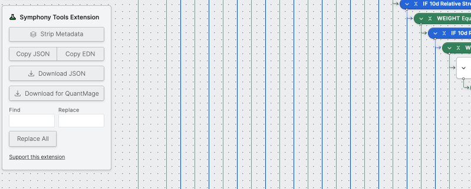

# symphony-tools

Chrome Extension that provides tools and enhancements to the [Composer.trade](https://composer.trade) user interface.

> **Note:** This is the actively maintained fork of [dpods/symphony-tools](https://github.com/dpods/symphony-tools), which is no longer maintained. If you found the original project, this is the canonical version going forward.

### Features

- **Symphony Editor**
  - Search and replace for assets and if/else logic in a symphony
  - Remove metadata from a symphony
  - Copy JSON / EDN (resilient to Composer API changes)
  - Download JSON
  - Download for QuantMage (converts data format for compatibility with QuantMage imports)
- **Background**
  - Keep-alive service to maintain session with the Composer API

### Installation

#### Manual Installation
1. Go to the latest release and download the .zip file
    https://github.com/jefe-johann/Composer-Symphony-Tools/releases/latest
2. Unzip the contents
3. In Chrome, navigate to [chrome://extensions](chrome://extensions/) in the URL bar
4. Click the **Load unpacked** button and select the `src` folder (where the `manifest.json` file is).
5. If you have the composer site open in your browser, refresh the page so the widget can load.
6. Where to find the widgets
   1. In the Symphony editor, the widget should appear on the sidebar under the Watch/Share buttons.
   2. In the portfolio view, the widget should appear at the bottom of the page under all your live symphonies.

#### Chrome Web Store
The original extension is available on the Chrome Web Store but is based on the unmaintained upstream version:
https://chromewebstore.google.com/detail/symphony-tools-extension/gbmghoigiaomcfnnoijngbdnglpifbkk

Manual installation from this repo is recommended to get the latest fixes and features.

### Troubleshooting

**Failed to load extension**

- **Manifest file is missing or unreadable** — Make sure you've unzipped the file. After clicking "Load unpacked" on the extensions page, navigate to the unzipped folder and click "Select".

### Credits

Originally created by [dpods](https://github.com/dpods). This fork continues development under the same [GPL v3 license](LICENSE).
